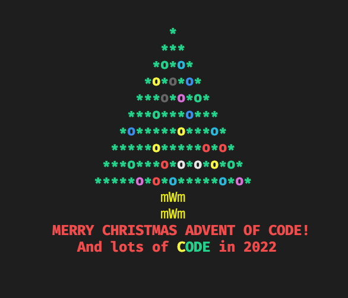

<div id="top"></div>

<!-- PROJECT SHIELDS -->
<!--
*** I'm using markdown "reference style" links for readability.
*** Reference links are enclosed in brackets [ ] instead of parentheses ( ).
*** See the bottom of this document for the declaration of the reference variables
*** for contributors-url, forks-url, etc. This is an optional, concise syntax you may use.
*** https://www.markdownguide.org/basic-syntax/#reference-style-links
-->
<div align="center">
<a href="https://nodejs.dev/">
    
  </a>
</div>


<!-- PROJECT LOGO -->
<br />
<div align="center">
  <a href="https://github.com/beccabrown/AdventOfCode">
    
  </a>

  <h3 align="center">Advent of Code 2021 - Bex Brown</h3>
</div>


<!-- TABLE OF CONTENTS -->
<details>
  <summary>Table of Contents</summary>
  <ol>
    <li>
      <a href="#about-the-project">About The Project</a>
      <ul>
        <li><a href="#built-with">Built With</a></li>
      </ul>
    </li>
    <li>
      <a href="#getting-started">Getting Started</a>
      <ul>
        <li><a href="#prerequisites">Prerequisites</a></li>
        <li><a href="#installation">Installation</a></li>
      </ul>
    </li>
    <li><a href="#roadmap">Roadmap</a></li>
  </ol>
</details>


## About The Project

I wanted to use Node's internal modules only, so no reliance on dependencies

<p align="right">(<a href="#top">back to top</a>)</p>

### Built With

* [Node.js](https://nodejs.dev/)

<p align="right">(<a href="#top">back to top</a>)</p>


## Getting Started

This is an example of how you may give instructions on setting up your project locally.
To get a local copy up and running follow these simple example steps.

### Prerequisites

I used Node v14.18.0, use [asdf](http://asdf-vm.com/) or [nvm](https://www.linode.com/docs/guides/how-to-install-use-node-version-manager-nvm/) to manage this.

### Installation

1. Clone the repo
   ```sh
   git clone https://github.com/beccabrown/AdventOfCode.git
   ```
2. Change directories to the year and day
   ```sh
   cd 2021/day1
   ```
3. ```sh
   node count.js
   ```

<p align="right">(<a href="#top">back to top</a>)</p>

## Roadmap

- [ ] Add in problem outlines
- [ ] Update each day so both parts can be used
- [ ] Make functions/more descriptive variable names

<p align="right">(<a href="#top">back to top</a>)</p>